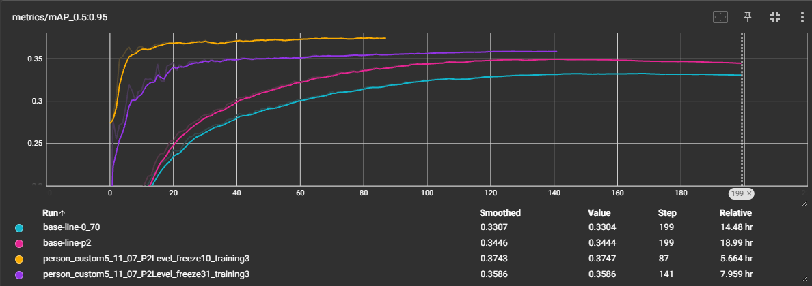

# YOLOv5 with Cross-Attention and P2 Layer Optimizations

This repository contains a modified YOLOv5 model with cross-attention modules and P2 layer optimizations, designed for improved **small object detection** performance through transfer learning techniques.

## Overview

The main objective of this project is to enhance YOLOv5's detection capabilities by:
- **Cross-Attention Integration**: Multiple cross-attention variants (CrossAttention, CrossAttentionV2, etc.) integrated into the neck architecture
- **P2 Layer Optimizations**: Additional detection layer (P2) for better small object detection
- **Transfer Learning**: Optimized training procedures for fine-tuning on custom datasets

## Model Architecture

Normal neck of yolov5 model: 


Modified #1 neck of yolov5 with cross attention: 


Modified #2 neck of yolov5 with cross attention: 


Modified #3 neck of yolov5 with cross attention: 


## Available Models

The repository includes several model configurations:
- `yolov5m-crossattnv3.yaml` - Cross-attention v3 variant
- `yolov5m-crossattnv3-p2.yaml` - Cross-attention v3 with P2 layer optimization
- `yolov5m-crossattnv3-cbam-p2.yaml` - Cross-attention v3 with CBAM and P2 layer
- Additional variants: v2, v5, swint, self-attention, and more

## Usage

Training with cross-attention model:
```bash
python train.py --img 640 --batch 16 --epochs 300 --data coco.yaml --cfg models/yolov5m-crossattnv3-p2.yaml --weights yolov5m.pt
```

## Results

Training results demonstrate significant improvements with cross-attention and P2 layer optimizations:



### Performance Metrics

| Model | mAP@0.5 | mAP@0.5:0.95 | Training Time | Steps |
|-------|---------|--------------|---------------|-------|
| Baseline (YOLOv5m) | 0.702 | 0.330 | 14.48 hr | 199 |
| Baseline + P2 | 0.719 | 0.344 | 18.99 hr | 199 |
| **Cross-Attention + P2 (freeze10)** | **0.778** | **0.375** | **5.66 hr** | **87** |
| Cross-Attention + P2 (freeze31) | 0.776 | 0.359 | 7.96 hr | 141 |

### Improvements

- **mAP@0.5 improvement**: From 0.70 to **0.78** (+11.4% relative improvement)
- **mAP@0.5:0.95 improvement**: From 0.33 to **0.375** (+13.6% relative improvement)
- **Faster convergence**: Best model achieves higher performance in 87 steps (5.66 hours) vs 199 steps (14.48 hours) for baseline
- The cross-attention with P2 layer and transfer learning (freeze10) configuration shows the best performance with faster training convergence
